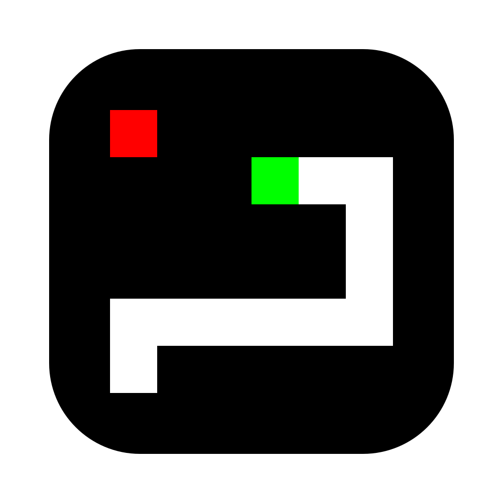
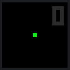

# Snake



Simple program of snake game.

<br><br>

## Interaction

Control snake movement direction with `W`, `A`, `S`, `D` and arrow keys.



## Build

### Requirements

* `Swift` >= 6.0
* `MacOS` >= 14.0

### Generate logo

```bash
(cd ./res && ./generate_logo.sh)
```

### Compile program and bundle it to installation archive

```bash
./bundle.sh
```

### Run application

Install created `Snake.dmg` or run program directly with:

```bash
./Snake.app/Contents/MacOS/snake
```
